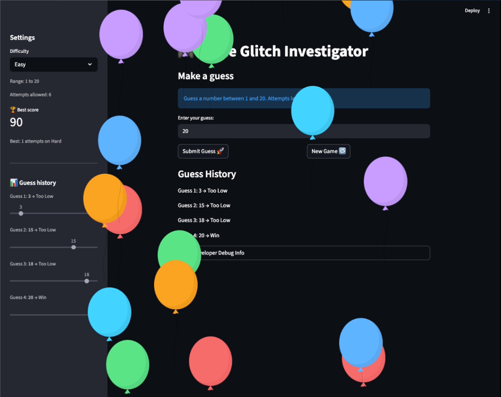

# 🎮 Game Glitch Investigator: Final Report

## 🕵️‍♂️ Project Overview

This project involved a deep-dive investigation into an AI-generated Python game that was shipped with critical logic, state management, and UI glitches. As the Lead Investigator, I diagnosed code-level causes, collaborated with AI to refactor the codebase, and implemented a verified test suite to ensure stability.

## 🛠️ The Bug Report: Summary of Repairs
I identified and resolved four critical glitches to stabilize the game logic and UI:

* Inverted Directional Hints: Fixed logic in check_guess() where "Higher" and "Lower" instructions were swapped.

* Stale UI Data: Updated the informational "Blue Card" to dynamically reflect range and attempt changes based on the selected difficulty.

* State Persistence Error: Modified the "New Game" logic to ensure that previous guess history and error messages are fully cleared.

* Difficulty Synchronization: Implemented an on_change trigger to force a new secret number and reset attempts whenever the difficulty is switched.

## 💡 Implementation & AI Collaboration

I utilized **VS Code Copilot Agent Mode** to refactor core logic from `app.py` into `logic_utils.py` to improve modularity.

* **Refactoring**: Used `#codebase` context to ensure the AI understood the relationship between the Streamlit UI and the utility functions.

* **Fix Verification**: Every fix was verified using `pytest`. I implemented a "Test-Driven" approach by writing the test for the "Inverted Hint" glitch before applying the final code fix.

* **AI Critique**: While Copilot correctly identified the session state issue, it initially suggested an incorrect fix for the "Hard" mode range (suggesting 1-1000 instead of the intended 1-100), which I manually corrected to maintain game balance.

## 📸 Working Game Demonstration

Evidence that the updated game runs without crashing and logic behaves as intended.

## 🚀 Stretch Features Implemented

* **Advanced Edge-Case Testing**: Added `pytest` cases for non-numeric strings and empty inputs.
* **Professional Style**: Applied PEP 8 standards and generated docstrings for all logic functions.
* **UI Enhancements**: Added structured "Guess History" logs and Best Score for player experience.

## ⚙️ Setup & Execution

1. **Install dependencies**: `pip install -r requirements.txt` 
2. **Run the app**: `streamlit run app.py` 
3. **Run tests**: `pytest` 

